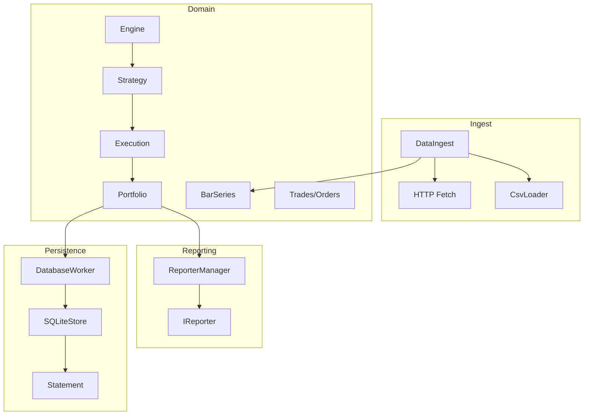
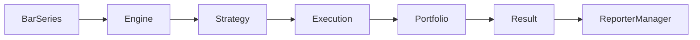

# QuantumGradesApp

> **Current Version:** `v0.7.1`
> **Build System:** CMake
> **IDE Support:** Visual Studio Code (fully configured)
> **Documentation:** Auto-generated with Doxygen
> **Unit Testing:** Doctest

C++20 project evolving from a simple grades/statistics demo into a **quantitative backtesting framework** with clean modular design.

---

## Features (current – v0.7.1)

- **Config system**: JSON + ENV overrides, validation (fully functional)
- **Statistics**: core metrics (avg, variance, percentiles), refactored structure (moved to `core/`)
- **FileManager**: lightweight I/O utilities (static, no state)
- **Logger**: async `spdlog` + DI, `NullLogger`, `MockLogger`
- **DataIngest**: CSV + HTTP ingestion (refactored, tested, HTTP fixtures)
- **Domain models**:
  - Backtest: `Engine`, `BarSeries`, `Portfolio`, `Orders`, `Trades`, `Execution`
  - Strategies: `Buy & Hold`, `Moving Average Crossover`
- **Tests**: doctest-based, modular; improved HTTP tests; unified test data structure
- **Docs**: Doxygen + updated diagrams (`backtest_flow`, `class_diagram`)
- **CI**: Ubuntu (`ccache`), Windows (`sccache`), improved `vcpkg` stability; optional TSAN build

---

## Roadmap

### v0.7.1
- CSV/JSON Reporters implemented.
- Introduced `IReporter` interface and observer model.
- Updated diagrams (Mermaid + DOT) to reflect new reporter architecture.
- Legacy demos archived (`examples/`).
- Cleaner documentation structure and improved navigation.
- Cleanup & refactor documentation structure.

### v0.8.0
- CLI for scenario runs.
- Scenario profiles in Config.
- End-to-end flow tests.
- Automated test validation scripts.

### v0.9.0
- Metrics: MDD, Sharpe, Sortino, CAGR.
- clang-format/tidy integration in CI.
- Benchmark and profiling support.

### v1.x
- Stable MVP + REST API.
- Python bindings (pybind11).
- Desktop UI (Qt/QML) or Web UI (React/Angular).
- API v2 (auth, pagination, OpenAPI).
- Observability & monitoring.

### v2.x
- Parallel backtest engine, GPU offload (CUDA/SYCL).
- Scaling: streams, mmap, checkpointing.
- Quantum SDK PoC strategy.
- ML pipeline integration.
- Benchmarks + fuzz/system tests.

### v3.0.0
- Mobile app (Android/iOS).
- Public benchmarks.
- Production-ready release.

---

## Architecture

### Module Overview

The project is organized into clearly separated modules reflecting clean architecture principles.

#### core/
Contains foundational components shared across modules:
- Config system (JSON + ENV + schema validation)
- Statistics engine
- Platform utilities
- Versioning utilities

#### domain/
Contains all domain-specific models used by the backtest engine:
- Backtest models: BarSeries, Engine, Portfolio, Order, Trade, Execution, Position, Result, Instrument, Quote
- Strategy interfaces and concrete strategies (Buy & Hold, Moving Average Crossover)

#### ingest/
Responsible for loading external data:
- DataIngest: orchestrates CSV/HTTP ingestion

#### io/
Low-level input/output layer:
- CsvLoader
- FileManager
- DataExporter (CSV/JSON reporters use this)

#### persistence/
Database abstraction layer:
- IDataStore interface
- SQLiteStore implementation
- Statement helper
- PersistenceFactory
- DatabaseWorker (async)

#### reporting/
Observer-based reporting system:
- IReporter interface
- ReporterManager orchestrates registered reporters

#### strategy/
User-provided or built-in strategies implementing IStrategy.

#### utils/
General-purpose utilities:
- ILogger and implementations (SpdLogger, NullLogger, MockLogger)
- LoggerFactory for DI-based logger retrieval

### High-Level Architecture Diagram



### Backtest Engine Flow
Detailed flow is provided in `docs/pages/backtest_flow.md`.


flowchart TD
    A[BarSeries] --> B[Engine]
    B --> C[Strategy]
    C --> D[Execution]
    D --> E[Portfolio]
    E --> F[Result]
```

### Class Diagram
See `docs/pages/class_diagram.md` for detailed OOP structure.

```
classDiagram
    class Engine
    class BarSeries
    class Strategy
    class Portfolio
    class Order
    class Trade
    class Execution

    Engine --> BarSeries
    Engine --> Strategy
    Portfolio --> Trade
    Portfolio --> Order
```

---

## Project Structure

```bash
QuantumGradesApp/
├─ .github/
├─ .vscode/
├─ build/
├─ changelog/
├─ config/
├─ data/
├─ docs/
│  ├─ diagrams/
│  ├─ *.md
│  └─ *.dox
├─ examples/
│  ├─ backtest_demo/
│  ├─ grades_demo/
│  ├─ logger_demo/
│  └─ CMakeLists.txt
├─ external/
│  └─ doctest.h
├─ include/
│  ├─ common/
│  │  ├─ LogLevel.hpp
│  │  ├─ Platform.hpp
│  │  └─ Version.hpp
│  ├─ core/
│  │  ├─ Config.hpp
│  │  └─ Statistics.hpp
│  ├─ domain/
│  │  ├─ backtest/
│  │  │  ├─ BarSeries.hpp
│  │  │  ├─ Engine.hpp
│  │  │  ├─ Execution.hpp
│  │  │  ├─ Order.hpp
│  │  │  ├─ Portfolio.hpp
│  │  │  ├─ Position.hpp
│  │  │  ├─ Result.hpp
│  │  │  ├─ Trade.hpp
│  │  │  ├─ Instrument.hpp
│  │  │  └─ Quote.hpp
│  ├─ ingest/
│  │  └─ DataIngest.hpp
│  ├─ io/
│  │  ├─ CsvLoader.hpp
│  │  ├─ DataExporter.hpp
│  │  └─ FileManager.hpp
│  ├─ persistence/
│  │  ├─ DatabaseWorker.hpp
│  │  ├─ IDataStore.hpp
│  │  ├─ PersistenceFactory.hpp
│  │  ├─ SQLiteStore.hpp
│  │  └─ Statement.hpp
│  ├─ reporting/
│  │  ├─ IReporter.hpp
│  │  └─ ReporterManager.hpp
│  ├─ strategy/
│  │  ├─ BuyHold.hpp
│  │  ├─ IStrategy.hpp
│  │  └─ MACrossover.hpp
│  └─ utils/
│     ├─ ILogger.hpp
│     ├─ LoggerFactory.hpp
│     ├─ MockLogger.hpp
│     ├─ NullLogger.hpp
│     └─ SpdLogger.hpp
├─ logs/
├─ sql/migrations/
│  ├─ 001_init.sql
│  ├─ 002_add_barseries.sql
│  ├─ 003_add_portfolio.sql
│  └─ migrations.sql
├─ src/
│  ├─ core/
│  ├─ domain/
│  ├─ ingest/
│  ├─ io/
│  ├─ persistence/
│  ├─ reporting/
│  ├─ strategy/
│  └─ utils/
├─ tests/
├─ tools/
├─ vcpkg_triplets/
├─ CMakeLists.txt
├─ .clang-format
├─ .clang-tidy
└─ LICENSE.txt
```

